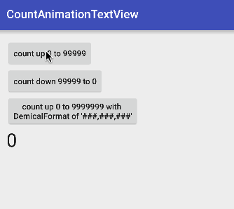

# CountAnimationTextView
[](http://developer.android.com/index.html)

[](https://android-arsenal.com/details/1/3307)

A tiny Android library makes very easier count animation of TextView.



# Usage
Include the CountAnimationTextView widget in your layout.
```xml
    <com.daasuu.cat.CountAnimationTextView
        android:id="@+id/count_animation_textView"
        android:layout_width="wrap_content"
        android:layout_height="wrap_content"
        android:text="0"
        />
```
In your onCreate method (or onCreateView for a fragment), bind the widget.
```JAVA
    @Override
    protected void onCreate(Bundle savedInstanceState) {
        super.onCreate(savedInstanceState);
        setContentView(R.layout.activity_main);

        mCountAnimationTextView = (CountAnimationTextView) findViewById(R.id.count_animation_textView);
    }
```
Animate Count with Duration
```JAVA
    mCountAnimationTextView
        .setAnimationDuration(5000)
        .countAnimation(0, 99999);
```
Animate Count with DecimalFormat
```JAVA
    mCountAnimationTextView
        .setDecimalFormat(new DecimalFormat("###,###,###"))
        .setAnimationDuration(10000)
        .countAnimation(0, 9999999);
```
Animate Count with interPolator
```JAVA
    mCountAnimationTextView
        .setInterpolator(new AccelerateInterpolator())
        .countAnimation(0, 9999999);
```

# Gradle

Add the dependency to your build.gradle.

```
dependencies {
    compile 'com.daasuu:CountAnimationTextView:0.1.2'
}
```

## License
Copyright 2015 MasayukiSuda

MIT License

Permission is hereby granted, free of charge, to any person obtaining a copy of this software and associated documentation files (the "Software"), to deal in the Software without restriction, including without limitation the rights to use, copy, modify, merge, publish, distribute, sublicense, and/or sell copies of the Software, and to permit persons to whom the Software is furnished to do so, subject to the following conditions:

The above copyright notice and this permission notice shall be included in all copies or substantial portions of the Software.

THE SOFTWARE IS PROVIDED "AS IS", WITHOUT WARRANTY OF ANY KIND, EXPRESS OR IMPLIED, INCLUDING BUT NOT LIMITED TO THE WARRANTIES OF MERCHANTABILITY, FITNESS FOR A PARTICULAR PURPOSE AND NONINFRINGEMENT. IN NO EVENT SHALL THE AUTHORS OR COPYRIGHT HOLDERS BE LIABLE FOR ANY CLAIM, DAMAGES OR OTHER LIABILITY, WHETHER IN AN ACTION OF CONTRACT, TORT OR OTHERWISE, ARISING FROM, OUT OF OR IN CONNECTION WITH THE SOFTWARE OR THE USE OR OTHER DEALINGS IN THE SOFTWARE.
